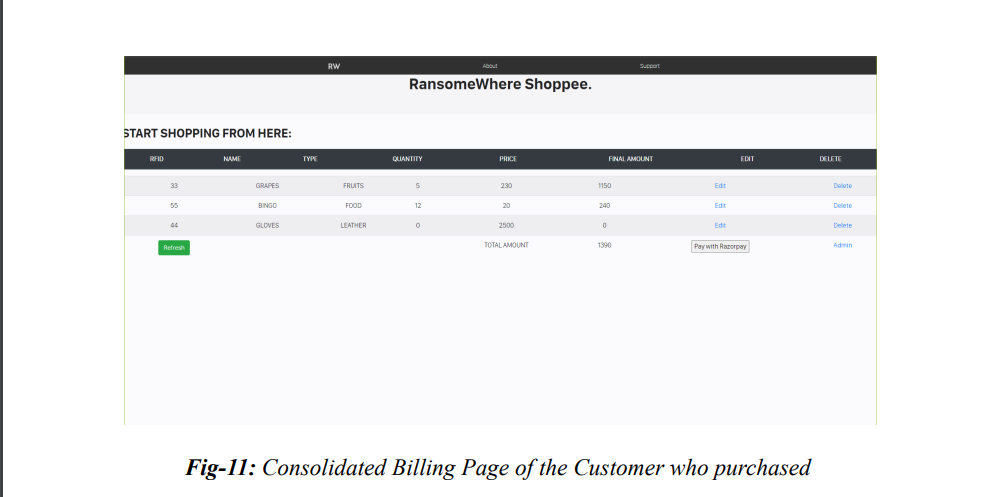
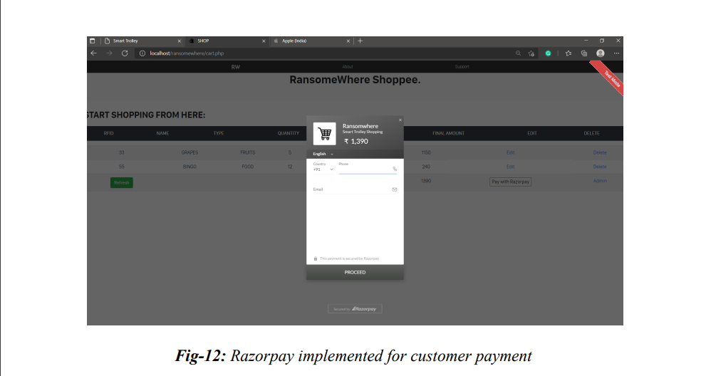
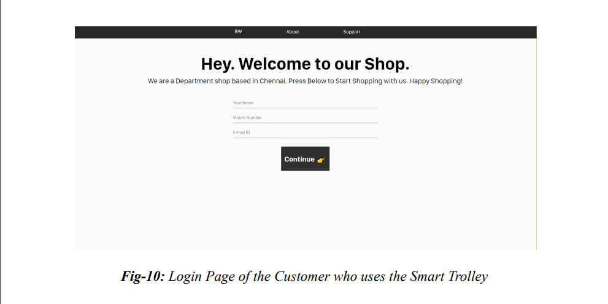
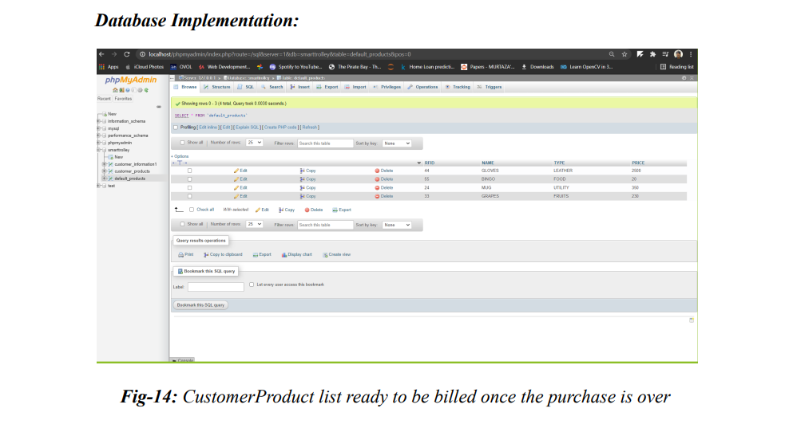

# Smart Trolley System Readme

## Table of Contents

- [Introduction](#introduction)

- [Hardware Components](#hardware-components)

- [Software Components](#software-components)

- [Block Diagram](#block-diagram)

- [Front End Implementation](#front-end-implementation)

- [Back End Implementation](#back-end-implementation)

- [Arduino Implementation](#arduino-implementation)

- [Results](#results)

- [Conclusion](#conclusion)

## Introduction

The Smart Trolley System is a mobile self-checkout solution designed for retail stores. This system allows customers to shop conveniently and efficiently by scanning RFID tags on products and completing their purchases online. This `readme.md` file provides an overview of the project and its components.

## Hardware Components

- **ESP8266 NodeMCU**

  - Microcontroller: Tensilica 32-bit RISC CPU Xtensa LX106

  - Operating Voltage: 3.3V

  - Input Voltage: 7-12V

  - Digital I/O Pins: 16

  - Analog Input Pins: 1

  - Flash Memory: 4 MB

  - SRAM: 64 KB

- **EM18 RFID Reader Module**

  - Operating voltage: +4.5V to +5.5V

  - Current consumption: 50mA

  - Operating frequency: 125KHz

- **RFID Tags**

- Other necessary components

## Software Components

- **XAMPP (Apache and MySQL)**

- **Arduino IDE**

- **Visual Studio Code** (for front-end development)

- **Languages:**

  - HTML

  - CSS

  - JavaScript

  - PHP

  - C++

## Block Diagram

<screenshots/block diagram.png>

## Flow Chart

<screenshots/flow chart.png>

## Front End Implementation

The front-end of the Smart Trolley System is a user-friendly website that allows customers to interact with the system. It includes:

- Homepage

- About Page

- Shopping Cart

- Contact Page

- Razorpay Integration for Payments

- Admin Login for Database Management

## Back End Implementation

The back-end of the system is implemented using PHP and MySQL for database management. It includes:

- Customer Data Collection

- RFID Tag Scanning and Product Addition

- Cart Management

- Razorpay Integration for Payments

- Admin Functions for Database Management

- Customer Support Form

## Arduino Implementation

The NodeMCU is programmed in Embedded C to handle RFID scanning and communication with the web server. It uses HTTP POST requests to send RFID data to the server.

## Results

The Smart Trolley System prototype includes both hardware and web components. It successfully allows customers to scan products, add them to their cart, make payments, and receive receipts. The system also provides admin functionality for managing products and customer data.

## Conclusion

The Smart Trolley System is designed to improve the shopping experience by reducing checkout times and providing a convenient, contactless shopping option. It streamlines the purchasing process and offers benefits for both customers and retailers.